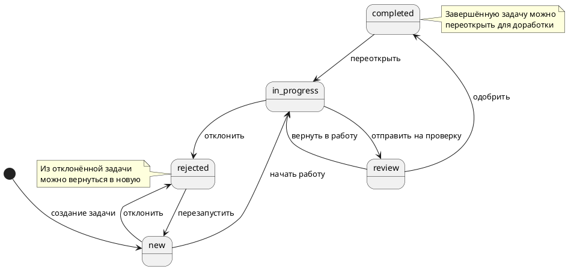
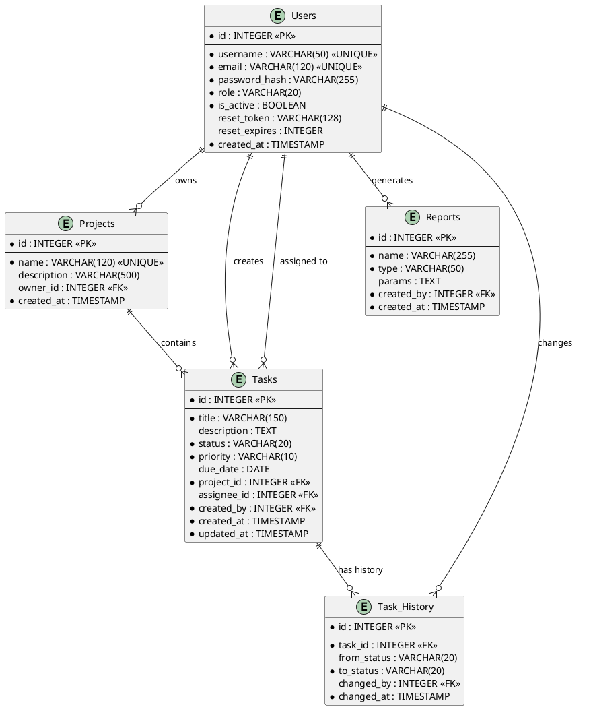
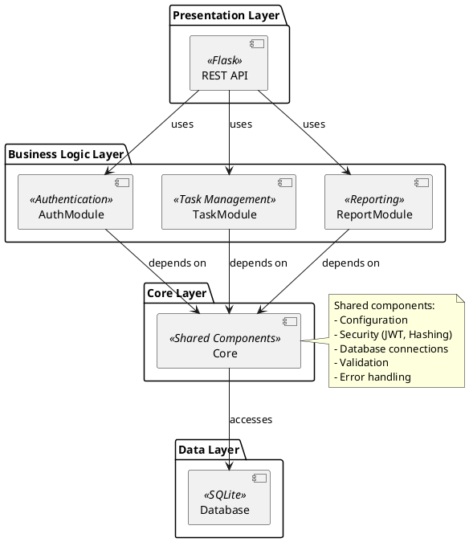

# Математические модели системы ProjectFlow

## 1. Диаграмма состояний задачи (State Diagram)

### 1.1 Описание модели

Задача в системе ProjectFlow может находиться в одном из пяти состояний:
- **new** (новая) — задача создана, но работа не начата
- **in_progress** (в работе) — исполнитель работает над задачей
- **review** (на проверке) — задача выполнена и ожидает проверки
- **completed** (завершена) — задача успешно завершена
- **rejected** (отклонена) — задача отклонена

### 1.2 Формальное описание

Модель состояний задачи представляет собой конечный автомат (FSM):

**M = (S, Σ, δ, s₀, F)**

где:
- **S** = {new, in_progress, review, completed, rejected} — множество состояний
- **Σ** = {start_work, send_to_review, approve, reject, return_to_work, restart} — множество событий
- **δ: S × Σ → S** — функция переходов
- **s₀** = new — начальное состояние
- **F** = {completed} — множество конечных состояний

### 1.3 Функция переходов δ

```
δ(new, start_work) = in_progress
δ(new, reject) = rejected

δ(in_progress, send_to_review) = review
δ(in_progress, reject) = rejected

δ(review, approve) = completed
δ(review, return_to_work) = in_progress

δ(rejected, restart) = new

δ(completed, reopen) = in_progress
```

### 1.4 Диаграмма состояний (PlantUML)



### 1.5 Матрица переходов

| Из \ В | new | in_progress | review | completed | rejected |
|--------|-----|-------------|--------|-----------|----------|
| **new** | - | ✓ | - | - | ✓ |
| **in_progress** | - | - | ✓ | - | ✓ |
| **review** | - | ✓ | - | ✓ | - |
| **completed** | - | ✓ | - | - | - |
| **rejected** | ✓ | - | - | - | - |

### 1.6 Свойства модели

1. **Детерминированность**: Из каждого состояния при заданном событии существует не более одного перехода.

2. **Достижимость**: Все состояния достижимы из начального состояния `new`.

3. **Восстанавливаемость**: Из состояния `rejected` возможен возврат в `new` для повторной попытки. Из состояния `completed` возможен возврат в `in_progress` для переоткрытия завершённой задачи.

4. **Гибкость**: Система позволяет переоткрывать завершённые задачи (переход T8: completed → in_progress), что обеспечивает гибкость управления жизненным циклом задач.

---

## 2. ER-диаграмма базы данных

### 2.1 Описание сущностей

**Users (Пользователи)**
- **id**: INTEGER PRIMARY KEY — уникальный идентификатор
- **username**: VARCHAR(50) UNIQUE NOT NULL — имя пользователя
- **email**: VARCHAR(120) UNIQUE NOT NULL — email
- **password_hash**: VARCHAR(255) NOT NULL — хеш пароля
- **role**: VARCHAR(20) NOT NULL — роль (admin, manager, executor)
- **is_active**: BOOLEAN DEFAULT TRUE — активность аккаунта
- **reset_token**: VARCHAR(128) — токен сброса пароля
- **reset_expires**: INTEGER — срок действия токена
- **created_at**: TIMESTAMP — дата создания

**Projects (Проекты)**
- **id**: INTEGER PRIMARY KEY — уникальный идентификатор
- **name**: VARCHAR(120) UNIQUE NOT NULL — название проекта
- **description**: VARCHAR(500) — описание проекта
- **owner_id**: INTEGER FK(users.id) — владелец проекта
- **created_at**: TIMESTAMP — дата создания

**Tasks (Задачи)**
- **id**: INTEGER PRIMARY KEY — уникальный идентификатор
- **title**: VARCHAR(150) NOT NULL — заголовок
- **description**: TEXT — описание
- **status**: VARCHAR(20) NOT NULL — статус задачи
- **priority**: VARCHAR(10) NOT NULL — приоритет
- **due_date**: DATE — срок выполнения
- **project_id**: INTEGER FK(projects.id) — проект
- **assignee_id**: INTEGER FK(users.id) — исполнитель
- **created_by**: INTEGER FK(users.id) — создатель
- **created_at**: TIMESTAMP — дата создания
- **updated_at**: TIMESTAMP — дата обновления

**Reports (Отчёты)**
- **id**: INTEGER PRIMARY KEY — уникальный идентификатор
- **name**: VARCHAR(255) NOT NULL — название отчёта
- **type**: VARCHAR(50) NOT NULL — тип отчёта
- **params**: TEXT — параметры (JSON)
- **created_by**: INTEGER FK(users.id) — создатель
- **created_at**: TIMESTAMP — дата создания

**Task_History (История задач)**
- **id**: INTEGER PRIMARY KEY — уникальный идентификатор
- **task_id**: INTEGER FK(tasks.id) — задача
- **from_status**: VARCHAR(20) — предыдущий статус
- **to_status**: VARCHAR(20) NOT NULL — новый статус
- **changed_by**: INTEGER FK(users.id) — кто изменил
- **changed_at**: TIMESTAMP — дата изменения

### 2.2 Связи между сущностями

```
Users (1) ----< (N) Projects : owner_id
Users (1) ----< (N) Tasks : created_by
Users (1) ----< (N) Tasks : assignee_id
Users (1) ----< (N) Reports : created_by
Users (1) ----< (N) Task_History : changed_by

Projects (1) ----< (N) Tasks : project_id

Tasks (1) ----< (N) Task_History : task_id
```

### 2.3 ER-диаграмма (PlantUML)



### 2.4 Нормальные формы

База данных спроектирована в третьей нормальной форме (3NF):

1. **1NF**: Все атрибуты атомарны, нет повторяющихся групп.
2. **2NF**: Нет частичных зависимостей от составных ключей (все ключи простые).
3. **3NF**: Нет транзитивных зависимостей неключевых атрибутов.

---

## 3. Граф зависимостей модулей

### 3.1 Описание графа

Граф зависимостей представляет собой ориентированный ациклический граф (DAG):

**G = (V, E)**

где:
- **V** = {Core, AuthModule, TaskModule, ReportModule, Database, REST_API} — вершины (модули)
- **E** ⊆ V × V — рёбра (зависимости)

### 3.2 Множество рёбер

```
E = {
  (REST_API, AuthModule),
  (REST_API, TaskModule),
  (REST_API, ReportModule),
  (AuthModule, Core),
  (TaskModule, Core),
  (ReportModule, Core),
  (Core, Database)
}
```

### 3.3 Диаграмма зависимостей (PlantUML)



### 3.4 Матрица зависимостей

| Модуль | REST_API | AuthModule | TaskModule | ReportModule | Core | Database |
|--------|----------|------------|------------|--------------|------|----------|
| **REST_API** | - | → | → | → | - | - |
| **AuthModule** | - | - | - | - | → | - |
| **TaskModule** | - | - | - | - | → | - |
| **ReportModule** | - | - | - | - | → | - |
| **Core** | - | - | - | - | - | → |
| **Database** | - | - | - | - | - | - |

### 3.5 Уровни абстракции

```
Level 4: REST_API (Presentation)
         ↓
Level 3: AuthModule, TaskModule, ReportModule (Business Logic)
         ↓
Level 2: Core (Shared Services)
         ↓
Level 1: Database (Data Access)
```

### 3.6 Поток данных

```
Клиент
  ↓ HTTP Request
REST_API
  ↓ Function Call
Business Module (Auth/Task/Report)
  ↓ Function Call
Core (Security/Validation)
  ↓ SQL Query
Database
  ↓ Result
Core
  ↓ Processed Data
Business Module
  ↓ JSON Response
REST_API
  ↓ HTTP Response
Клиент
```

---

## 4. Математическая модель управления доступом (RBAC)

### 4.1 Формальная модель

Модель управления доступом на основе ролей (RBAC):

**RBAC = (U, R, P, UA, PA)**

где:
- **U** = {u₁, u₂, ..., uₙ} — множество пользователей
- **R** = {admin, manager, executor} — множество ролей
- **P** = {p₁, p₂, ..., pₘ} — множество привилегий
- **UA** ⊆ U × R — отношение назначения пользователей ролям
- **PA** ⊆ P × R — отношение назначения привилегий ролям

### 4.2 Множество привилегий

```
P = {
  create_user,
  update_user_role,
  deactivate_user,
  create_project,
  update_project,
  delete_project,
  create_task,
  update_task,
  delete_task,
  assign_task,
  view_task,
  change_task_status,
  generate_report,
  export_report
}
```

### 4.3 Матрица привилегий по ролям

| Привилегия | executor | manager | admin |
|------------|----------|---------|-------|
| create_user | - | - | ✓ |
| update_user_role | - | - | ✓ |
| deactivate_user | - | - | ✓ |
| create_project | - | ✓ | ✓ |
| update_project | - | ✓ | ✓ |
| delete_project | - | ✓ | ✓ |
| create_task | ✓ | ✓ | ✓ |
| update_task | ✓ (own) | ✓ | ✓ |
| delete_task | - | ✓ | ✓ |
| assign_task | - | ✓ | ✓ |
| view_task | ✓ (own) | ✓ | ✓ |
| change_task_status | ✓ (own) | ✓ | ✓ |
| generate_report | ✓ (own) | ✓ | ✓ |
| export_report | ✓ | ✓ | ✓ |

### 4.4 Функция проверки доступа

```
can_access(u, p) = ∃r ∈ R : (u, r) ∈ UA ∧ (p, r) ∈ PA
```

Пользователь u имеет доступ к привилегии p, если существует роль r, которая назначена пользователю u и которой назначена привилегия p.

---

## 5. Метрики и показатели системы

### 5.1 Метрики производительности

**Время отклика системы:**
```
T_response = T_network + T_processing + T_database

где:
T_network — время передачи по сети
T_processing — время обработки запроса
T_database — время выполнения запроса к БД
```

**Пропускная способность:**
```
Throughput = N_requests / T_period

где:
N_requests — количество запросов
T_period — период времени
```

### 5.2 Метрики качества

**Покрытие кода тестами:**
```
Coverage = (N_covered_lines / N_total_lines) × 100%
```

**Цикломатическая сложность:**
```
V(G) = E - N + 2P

где:
E — количество рёбер графа потока управления
N — количество вершин
P — количество компонент связности
```

### 5.3 Метрики безопасности

**Стойкость пароля:**
```
Entropy = log₂(C^L)

где:
C — размер алфавита (для требований системы: 26+26+10 = 62)
L — минимальная длина пароля (8 символов)
Entropy ≥ log₂(62^8) ≈ 47.6 бит
```

---

## 6. Временная сложность операций

### 6.1 Операции аутентификации

| Операция | Сложность | Обоснование |
|----------|-----------|-------------|
| Хеширование пароля | O(n) | PBKDF2 с 120000 итераций |
| Проверка пароля | O(n) | Сравнение хешей |
| Создание JWT | O(1) | Кодирование фиксированных данных |
| Проверка JWT | O(1) | Декодирование и проверка подписи |

### 6.2 Операции с задачами

| Операция | Сложность | Обоснование |
|----------|-----------|-------------|
| Создание задачи | O(1) | INSERT в БД |
| Получение задачи по ID | O(1) | SELECT с индексом PRIMARY KEY |
| Получение списка задач | O(n + m log m) | Выборка n записей + сортировка m |
| Обновление задачи | O(1) | UPDATE с индексом |
| Изменение статуса | O(1) | UPDATE + INSERT в историю |

### 6.3 Операции с отчётами

| Операция | Сложность | Обоснование |
|----------|-----------|-------------|
| Формирование отчёта | O(n) | Обработка n задач |
| Экспорт в Excel | O(n) | Запись n строк |
| Экспорт в PDF | O(n) | Формирование n записей |

---

## 7. Заключение

Математические модели системы ProjectFlow обеспечивают:

1. **Корректность переходов состояний** — формализованная FSM гарантирует, что задачи могут переходить только между допустимыми состояниями.

2. **Целостность данных** — ER-диаграмма в 3NF обеспечивает отсутствие аномалий при обновлении данных.

3. **Модульность архитектуры** — граф зависимостей показывает чёткое разделение ответственности между модулями.

4. **Безопасность доступа** — RBAC модель обеспечивает контролируемый доступ к ресурсам системы.

5. **Производительность** — анализ временной сложности подтверждает, что все операции выполняются за приемлемое время.

Все модели реализованы в исходном коде системы и покрыты автоматическими тестами.
