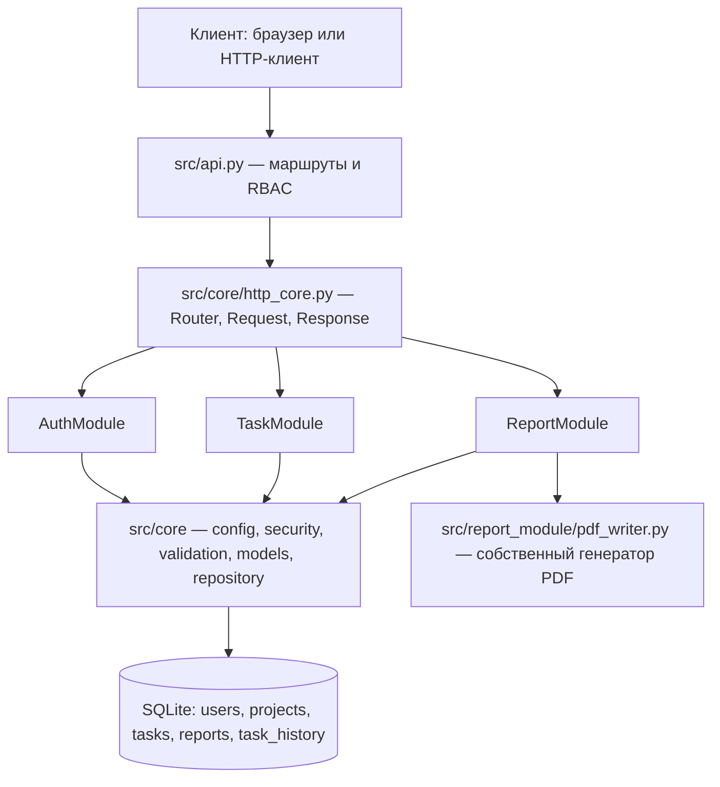

# Требования к модулям системы ProjectFlow

**Документ:** требования к программным модулям информационной системы управления проектами
**Шифр документа:** ПФ.ТР.01
**Версия:** 2.0
**Статус:** действующий

---

## 1. Введение

### 1.1. Назначение системы

ProjectFlow — информационная система управления проектами и задачами,
предназначенная для планирования работ, распределения задач между исполнителями,
контроля их выполнения и формирования аналитической отчётности. Система
обеспечивает единое хранилище сведений о пользователях, проектах и задачах,
разграничение доступа по ролям и получение отчётов в машиночитаемом и
печатном виде.

Система реализована как серверное приложение на языке Python, предоставляющее
REST API поверх протокола HTTP и единую базу данных SQLite. Приложение не
требует внешних веб-фреймворков: маршрутизация, разбор запросов, формирование
ответов и обработка ошибок выполнены средствами стандартной библиотеки
(`http.server`, `json`, `sqlite3`, `hmac`, `hashlib`, `secrets`).

Система состоит из трёх программных модулей:

| Модуль | Расположение | Ответственность |
|---|---|---|
| AuthModule | `src/auth_module/__init__.py` | регистрация, аутентификация, выпуск и обновление JWT, восстановление пароля, управление ролями и активностью учётных записей |
| TaskModule | `src/task_module/__init__.py` | ведение проектов и задач, назначение исполнителей, изменение статусов по матрице переходов, история изменений |
| ReportModule | `src/report_module/__init__.py` | формирование отчётов по исполнителю, проекту и периоду, экспорт в PDF и Excel |

### 1.2. Границы проекта

**В границах проекта:**

* три перечисленных модуля и обслуживающий их слой интеграции
  (`src/api.py`, `src/core/http_core.py`);
* общее ядро `src/core/`: конфигурация (`config.py`), доступ к данным
  (`database.py`, `repository.py`, `users_repo.py`, `projects_repo.py`),
  безопасность (`security.py`), валидация (`validation.py`), модель предметной
  области (`models.py`), прикладные исключения (`errors.py`), зависимости
  аутентификации (`auth_deps.py`);
* единая база данных SQLite с таблицами `users`, `projects`, `tasks`,
  `reports`, `task_history`;
* REST API, веб-интерфейс просмотра (`static/index.html`), инструменты
  сопровождения (`tools/`) и автоматические тесты (`tests/`).

**Вне границ проекта:**

* интеграция с внешними системами кадрового учёта, календарями и почтовыми
  шлюзами (токен восстановления пароля возвращается в ответе API и не
  отправляется по электронной почте);
* промышленная СУБД и горизонтальное масштабирование: система работает с
  файловой базой SQLite;
* мобильные и настольные клиенты;
* серверный механизм отзыва JWT (чёрный список токенов): применена схема с
  короткоживущим access-токеном, удаление токенов выполняет клиент.

### 1.3. Заинтересованные стороны

| Сторона | Интерес | Форма участия |
|---|---|---|
| Заказчик (руководство организации) | контроль исполнения проектных работ, сводная отчётность | постановка задачи, приёмка |
| Руководитель практики | соответствие работы программе практики и требованиям к документации | консультации, проверка отчёта |
| Менеджер проектов | планирование задач, назначение исполнителей, отчёты | основной пользователь роли `manager` |
| Исполнитель | получение назначенных задач, фиксация результатов | основной пользователь роли `executor` |
| Администратор системы | управление учётными записями и ролями | основной пользователь роли `admin` |
| Разработчик и сопровождающий | поддержка и развитие системы | сопровождение кода и документации |

### 1.4. Нормативные ссылки

* **ГОСТ 34.601-90** «Автоматизированные системы. Стадии создания» — основание
  для выделения стадий обследования, проектирования, разработки и испытаний.
* **ГОСТ 34.602-2020** «Комплекс стандартов на автоматизированные системы.
  Техническое задание на создание автоматизированной системы» — структура и
  состав требований настоящего документа.
* **ISO/IEC/IEEE 29148:2018** «Systems and software engineering — Life cycle
  processes — Requirements engineering» — требования к форме изложения и
  проверяемости требований.
* **ISO/IEC 25010:2011** «Systems and software Quality Requirements and
  Evaluation (SQuaRE) — System and software quality models» — модель качества
  программного продукта, использованная при формировании нефункциональных
  требований (раздел 4).
* **IEEE 830** «Recommended Practice for Software Requirements
  Specifications» — исторический стандарт, применённый как источник формы
  изложения критериев приёмки.
* **ГОСТ Р ИСО/МЭК 12207** «Системная и программная инженерия. Процессы
  жизненного цикла программных средств» — процессы верификации, сопровождения
  и документирования.

Иные стандарты в документе не используются; номера стандартов приведены только
для перечисленных документов.

### 1.5. Термины и обозначения

| Термин | Определение |
|---|---|
| Access-токен | JWT типа `access`, предъявляемый клиентом в заголовке `Authorization: Bearer` |
| Refresh-токен | JWT типа `refresh`, используемый только для получения нового access-токена |
| RBAC | управление доступом на основе ролей |
| Матрица переходов | множество допустимых переходов статуса задачи, заданное моделью `STATUS_TRANSITIONS` |
| Ядро | совокупность модулей `src/core`, разделяемых всеми прикладными модулями |
| Слой интеграции | `src/api.py` совместно с микро-фреймворком `src/core/http_core.py` |

---

## 2. Архитектура системы

### 2.1. Общая структура

Система построена по трёхзвенной схеме: клиент — REST API (слой интеграции) —
ядро и база данных. Прикладные модули не зависят друг от друга напрямую: обмен
данными выполняется через общее ядро и единую базу данных, а аутентификация —
через единый набор зависимостей.

```
                        +-----------------------------+
                        |   Клиент (браузер / curl)   |
                        +--------------+--------------+
                                       | HTTP/1.1, JSON
                                       v
        +-----------------------------------------------------------+
        |                 Слой интеграции (src/api.py)              |
        |  register_routes(): /api/auth, /api/projects, /api/tasks, |
        |  /api/reports, служебные маршруты /, /api, /api/health    |
        |  _authorize(request, *roles)  — единая проверка JWT и роли|
        +--------------+--------------------------------------------+
                       | использует микро-фреймворк
                       v
        +-----------------------------------------------------------+
        |        src/core/http_core.py — Router, Request, Response,  |
        |        ThreadingHTTPServer, обработка ProjectFlowError     |
        +--------------+--------------------------------------------+
                       |
        +--------------+---------------+----------------------------+
        |              |               |                            |
        v              v               v                            v
  +-----------+  +-----------+  +---------------+         +------------------+
  | AuthModule|  | TaskModule|  | ReportModule  |         |  Общее ядро      |
  | регистра- |  | задачи,   |  | отчёты,       |         |  src/core:       |
  | ция, JWT, |  | проекты,  |  | экспорт PDF   |         |  config, errors, |
  | роли      |  | статусы   |  | и Excel       |         |  security,       |
  +-----+-----+  +-----+-----+  +-------+-------+         |  validation,     |
        |              |                |                 |  models,         |
        |              |                |                 |  auth_deps,      |
        |              |                |                 |  repository      |
        +--------------+----------------+-----------------+------------------+
                                      |
                                      v
                    +-----------------------------------+
                    |      SQLite: projectflow.db        |
                    | users, projects, tasks, reports,   |
                    | task_history (+ индексы)           |
                    +-----------------------------------+
```

Та же структура в виде диаграммы Mermaid:



### 2.2. Назначение модулей

**AuthModule** выполняет функции `register_user()`, `login_user()`,
`refresh_access_token()`, `request_password_reset()`, `reset_password()`,
`get_user_by_id()`, `update_user_role()`, `deactivate_user()`. Модуль хранит
пароли только в виде хеша PBKDF2-HMAC-SHA256 и выпускает JWT, подписанные
алгоритмом HS256.

**TaskModule** выполняет функции `create_task()`, `get_task_by_id()`,
`get_tasks()`, `update_task()`, `change_task_status()`, `assign_task()`,
`delete_task()`, `get_task_history()`. Словарь допустимых переходов
`VALID_STATUS_TRANSITIONS` вычисляется при импорте модуля из модели
`src/core/models.py`, что исключает расхождение между диаграммой состояний и
реализацией. Справочник проектов обслуживается функциями модуля
`src/core/projects_repo.py`.

**ReportModule** выполняет функции `generate_report_by_user()`,
`generate_report_by_project()`, `generate_report_by_period()`,
`export_report_to_excel()`, `export_report_to_pdf()`, `get_reports_list()`.
Отчёты формируются SQL-запросами к таблицам `tasks`, `projects`, `users`;
PDF-документ создаётся собственным генератором
`src/report_module/pdf_writer.py` без внешних библиотек; Excel-файл создаётся
библиотекой `openpyxl`, если она установлена.

### 2.3. Слой интеграции

`src/api.py` выполняет роль точки интеграции и решает четыре задачи:

1. **Единая маршрутизация.** Все маршруты трёх модулей регистрируются в одном
   экземпляре `Router` функцией `register_routes()` и обслуживаются одним
   многопоточным HTTP-сервером `create_server()`.
2. **Единая аутентификация.** Функция `_authorize(request, *roles)` извлекает
   Bearer-токен, проверяет его функцией `decode_access_token()`, загружает
   пользователя из БД, контролирует признак `is_active` и при необходимости
   проверяет роль. Один и тот же механизм применяется к маршрутам всех модулей.
3. **Единый контракт ответов.** Обработчики возвращают объект `Response`;
   прикладные исключения, унаследованные от `ProjectFlowError`, преобразуются
   в JSON-ответ вида `{"error": <код>, "message": <текст>}` с HTTP-кодом
   исключения.
4. **Единое хранилище.** Все модули работают с одной базой SQLite через
   `src/core/database.py`; соединение создаётся на поток, внешние ключи включены,
   журнал ведётся в режиме WAL, изменения выполняются в транзакциях
   (`transaction()`).

### 2.4. Потоки данных

**Поток 1. Регистрация и вход.** Клиент передаёт учётные данные в
`POST /api/auth/register` или `POST /api/auth/login` → `src/api.py` разбирает
JSON-тело → AuthModule валидирует данные (`src/core/validation.py`), хеширует
пароль (`src/core/security.py`) и обращается к таблице `users` через
`src/core/database.py` → клиент получает данные пользователя либо пару
access/refresh токенов.

**Поток 2. Авторизованный запрос к задачам.** Клиент передаёт access-токен в
заголовке `Authorization` → `_authorize()` проверяет подпись, срок действия,
тип токена и роль → TaskModule выполняет операцию над таблицами `tasks` и
`task_history` → клиент получает JSON-представление задачи.

**Поток 3. Изменение статуса и накопление истории.** `change_task_status()`
проверяет допустимость перехода по матрице модели и права роли, обновляет
`tasks.status` и добавляет запись в `task_history` (`from_status`, `to_status`,
`changed_by`, `changed_at`) в одной транзакции. Записи истории доступны
ReportModule и маршруту `GET /api/tasks/{task_id}/history`.

**Поток 4. Формирование отчёта.** Клиент вызывает маршрут `/api/reports/...`
→ ReportModule выполняет выборку задач с фильтрацией по исполнителю, проекту
или периоду → вычисляет статистику (по статусам, приоритетам, исполнителям,
проектам) → при наличии идентификатора пользователя сохраняет запись в таблицу
`reports` → возвращает JSON-документ отчёта.

**Поток 5. Экспорт.** JSON-документ отчёта передаётся в
`POST /api/reports/export/pdf` или `POST /api/reports/export/excel` →
ReportModule формирует файл в каталоге `reports` (PDF — собственным
генератором, Excel — библиотекой `openpyxl`) → клиент получает путь к файлу
в поле `file_path`.

**Поток 6. Ошибки.** Любое прикладное исключение (`ValidationError`,
`AuthenticationError`, `PermissionDeniedError`, `NotFoundError`,
`ConflictError`) преобразуется в JSON-ответ с кодом 400, 401, 403, 404, 409 или
500; непредвиденные исключения перехватываются обработчиком верхнего уровня и
возвращаются как 500 `internal_error`.

### 2.5. Технологические ограничения

| Ограничение | Значение |
|---|---|
| Язык | Python 3.10 и выше (разработка и тестирование — Python 3.12) |
| Веб-сервер | `http.server.ThreadingHTTPServer` из стандартной библиотеки |
| СУБД | SQLite, файл `projectflow.db`, режим WAL, внешние ключи включены |
| Формат обмена | JSON (UTF-8), HTTP/1.1 |
| Внешние зависимости | обязательных нет; `openpyxl` — опциональная зависимость только для экспорта в Excel |
| Формирование PDF | собственная реализация `src/report_module/pdf_writer.py` |

### 2.6. Основные сценарии использования

Ниже перечислены сценарии, определяющие требования к модулям. Каждый сценарий
опирается только на маршруты, перечисленные в разделе 5.2, и на данные,
хранящиеся в таблицах, описанных в разделе 6.

**Сценарий «Администратор готовит систему к работе».** Администратор
регистрирует пользователей, назначает им роли и при необходимости деактивирует
учётные записи уволенных сотрудников. Работа начинается с регистрации
(`POST /api/auth/register`), после чего администратор при необходимости
изменяет роль (`PUT /api/auth/users/{user_id}/role`) и просматривает список
учётных записей (`GET /api/auth/users`). Деактивация
(`POST /api/auth/users/{user_id}/deactivate`) не удаляет записи о прошлой
работе: задачи и история изменений сохраняются, однако деактивированный
пользователь больше не может войти в систему и обновить токен.

**Сценарий «Менеджер планирует работы».** Менеджер создаёт проект
(`POST /api/projects`), затем формирует задачи (`POST /api/tasks`) с
приоритетами и при необходимости сроком выполнения, назначает исполнителей
(`PATCH /api/tasks/{task_id}/assign`) и контролирует ход работ через список
задач с фильтрацией по проекту, исполнителю и статусу. Изменения проекта
выполняются запросом `PUT /api/projects/{project_id}`; удаление проекта
доступно только администратору, поскольку операция каскадно удаляет задачи
проекта.

**Сценарий «Исполнитель выполняет задачу».** Исполнитель получает назначенные
задачи (`GET /api/tasks?assigned_to=...`), уточняет детали задачи
(`GET /api/tasks/{task_id}`), при необходимости корректирует описание
(`PUT /api/tasks/{task_id}`) и фиксирует этапы работы, переводя задачу по
матрице переходов: `new → in_progress` при взятии в работу и
`in_progress → review` при передаче результата на проверку. Каждое изменение
статуса фиксируется в истории, поэтому ход работы можно восстановить
(`GET /api/tasks/{task_id}/history`).

**Сценарий «Приёмка результата».** Менеджер просматривает задачи, находящиеся
в статусе `review`, и либо принимает результат (`review → completed`), либо
возвращает задачу на доработку (`review → in_progress`), либо отклоняет
некорректно поставленную задачу (`new → rejected`, `in_progress → rejected`).
Отклонённая задача может быть возвращена в работу переходом
`rejected → new`; завершённая задача при необходимости переоткрывается
переходом `completed → in_progress`. Все перечисленные переходы выполняет
маршрут `PATCH /api/tasks/{task_id}/status`; недопустимые переходы
отклоняются системой.

**Сценарий «Формирование отчётности».** Руководитель или менеджер запрашивает
отчёт по конкретному исполнителю (`GET /api/reports/by-user/{user_id}`), по
проекту (`GET /api/reports/by-project/{project_id}`) или за период
(`GET /api/reports/by-period?start_date=...&end_date=...`). Отчёт содержит
статистику по статусам, приоритетам, исполнителям и проектам, а также перечень
задач; при формировании сохраняется запись в таблице `reports`, поэтому список
ранее сформированных отчётов доступен запросом `GET /api/reports`. Для передачи
отчёта в виде файла используются маршруты экспорта в Excel и PDF, а полученный
PDF-документ может быть проверен встроенным анализатором структуры.

**Сценарий «Восстановление доступа».** Пользователь, забывший пароль,
запрашивает токен восстановления по адресу электронной почты
(`POST /api/auth/password/reset-request`), а затем устанавливает новый пароль
(`POST /api/auth/password/reset`). Токен действует один час, после успешной
смены пароля он аннулируется, поэтому повторное использование того же значения
невозможно. Новый пароль обязан удовлетворять политике сложности, единой для
регистрации и восстановления доступа.

**Сценарий «Интеграция с внешней системой».** Внешний потребитель (скрипт
автоматизации, система отчётности вышестоящего уровня) обращается к API с
токеном, полученным для служебной учётной записи. Единый механизм
аутентификации обеспечивает работу одного токена со всеми модулями, а единый
контракт ошибок позволяет однозначно различать ситуации отсутствия прав
(HTTP 403), необходимости повторной аутентификации (HTTP 401), отсутствия
объекта (HTTP 404) и некорректных данных (HTTP 400).

---

## 3. Функциональные требования

Требования сгруппированы по модулям. Схема идентификаторов:
`FR-A-NN` — AuthModule, `FR-T-NN` — TaskModule, `FR-R-NN` — ReportModule,
`FR-I-NN` — слой интеграции. Приоритет указывается как «обязательное» или
«желательное». Источник требования — постановка задачи практики, модель
предметной области или архитектурное решение проекта.

### 3.1. Модуль авторизации и управления пользователями (AuthModule)

#### FR-A-01. Регистрация пользователя

* **Формулировка.** Система должна регистрировать нового пользователя по
  имени, адресу электронной почты, паролю и роли, сохраняя пароль только в виде
  хеша. Имя пользователя должно удовлетворять шаблону
  `^[A-Za-z0-9_.-]{3,50}$`; адрес электронной почты — шаблону
  `^[^@\s]+@[^@\s]+\.[A-Za-z]{2,}$`; роль — одному из значений `admin`,
  `manager`, `executor` (при отсутствии значения используется `executor`).
* **Приоритет.** Обязательное.
* **Источник.** Постановка задачи; модель `UserRole` (`src/core/models.py`).
* **Критерий приёмки.** `POST /api/auth/register` с валидными данными
  возвращает HTTP 201 и объект с полями `id`, `username`, `email`, `role`,
  `created_at`; поле `password_hash` в ответе отсутствует; в таблице `users`
  создана одна запись, значение `password_hash` имеет вид `salt$hash`; при
  нарушении шаблона имени или адреса возвращается HTTP 400 с кодом
  `validation_error`.

#### FR-A-02. Уникальность имени пользователя и адреса электронной почты

* **Формулировка.** Система не должна допускать создания двух учётных записей
  с одинаковым именем пользователя или одинаковым адресом электронной почты.
* **Приоритет.** Обязательное.
* **Источник.** Требование целостности учётных данных.
* **Критерий приёмки.** Повторная регистрация с существующим именем или
  адресом возвращает HTTP 400 и сообщение «Пользователь с таким именем или
  email уже существует»; число записей в `users` не изменяется; ограничения
  `UNIQUE` в схеме БД подтверждают требование на уровне хранения.

#### FR-A-03. Политика сложности пароля

* **Формулировка.** Пароль должен содержать не менее 8 символов, а также хотя
  бы одну заглавную букву, одну строчную букву и одну цифру. Политика
  применяется при регистрации и при установке нового пароля. Хеширование
  выполняется алгоритмом PBKDF2-HMAC-SHA256 со случайной солью длиной 32
  шестнадцатеричных символа.
* **Приоритет.** Обязательное.
* **Источник.** Требования информационной безопасности проекта; функция
  `is_password_strong()`.
* **Критерий приёмки.** Для каждого нарушения политики возвращается HTTP 400 с
  указанием конкретного требования (длина, заглавная буква, строчная буква,
  цифра); для пароля, удовлетворяющего политике, операция завершается успешно;
  в БД отсутствуют пароли в открытом виде.

#### FR-A-04. Проверка формата адреса электронной почты

* **Формулировка.** Система должна отклонять адреса электронной почты, не
  соответствующие шаблону `^[^@\s]+@[^@\s]+\.[A-Za-z]{2,}$`, и нормализовать
  принятое значение (удаление пробелов по краям, приведение к нижнему
  регистру).
* **Приоритет.** Обязательное.
* **Источник.** Функция `validate_email()` (`src/core/validation.py`).
* **Критерий приёмки.** Регистрация с адресом `userexample.com` возвращает
  HTTP 400 и сообщение «Некорректный email: адрес должен иметь вид
  user@example.com»; адрес, введённый в верхнем регистре, сохраняется в нижнем
  регистре.

#### FR-A-05. Вход в систему

* **Формулировка.** Система должна аутентифицировать пользователя по имени
  пользователя или адресу электронной почты и паролю и выдавать пару токенов:
  access-токен со сроком действия 3600 с и refresh-токен со сроком действия
  604800 с. Деактивированный пользователь не должен получать токены.
* **Приоритет.** Обязательное.
* **Источник.** Постановка задачи; `src/core/security.py`.
* **Критерий приёмки.** `POST /api/auth/login` с корректными данными
  возвращает HTTP 200 и объект с полями `access_token`, `refresh_token`,
  `token_type = "Bearer"`, `user` (без хеша пароля); claims access-токена
  содержат `user_id`, `role`, `type = "access"`, `exp = iat + 3600`, `iat`;
  неверный пароль и несуществующее имя возвращают HTTP 401 с одинаковым
  сообщением «Неверное имя пользователя или пароль»; вход деактивированного
  пользователя возвращает HTTP 401 «Аккаунт деактивирован».

#### FR-A-06. Обновление access-токена

* **Формулировка.** Система должна выдавать новый access-токен по действующему
  refresh-токену, проверяя его подпись, срок действия, тип (`refresh`) и
  активность пользователя.
* **Приоритет.** Обязательное.
* **Источник.** Постановка задачи.
* **Критерий приёмки.** `POST /api/auth/refresh` с валидным refresh-токеном
  возвращает HTTP 200 и новый `access_token`; повреждённый, просроченный или
  access-токен, переданный вместо refresh, возвращает HTTP 401 «Невалидный
  refresh токен»; refresh-токен деактивированного пользователя возвращает
  HTTP 401 «Пользователь не найден или деактивирован».

#### FR-A-07. Выход из системы

* **Формулировка.** Система должна подтверждать выход аутентифицированного
  пользователя. Применяется схема без серверного чёрного списка токенов:
  клиент удаляет сохранённые токены, сервер возвращает подтверждение и
  идентификатор пользователя.
* **Приоритет.** Обязательное.
* **Источник.** Архитектурное решение проекта (отсутствие серверного хранилища
  отозванных токенов).
* **Критерий приёмки.** `POST /api/auth/logout` с действующим access-токеном
  возвращает HTTP 200 и объект с полями `message`, `user_id`, `note`; запрос
  без токена возвращает HTTP 401; после истечения срока действия access-токена
  он перестаёт приниматься системой.

#### FR-A-08. Запрос восстановления пароля

* **Формулировка.** Система должна выдавать одноразовый токен восстановления
  пароля для активного пользователя по его адресу электронной почты и сохранять
  срок действия токена (1 час).
* **Приоритет.** Обязательное.
* **Источник.** Постановка задачи.
* **Критерий приёмки.** `POST /api/auth/password/reset-request` с адресом
  существующего активного пользователя возвращает HTTP 200 и поля `reset_token`,
  `message`; в записи `users` заполнены `reset_token` и `reset_expires`,
  равный текущему времени плюс 3600 с; для неизвестного адреса возвращается
  HTTP 400 «Пользователь с таким email не найден».

#### FR-A-09. Установка нового пароля по токену восстановления

* **Формулировка.** Система должна позволять установить новый пароль по
  действующему токену восстановления при условии соответствия нового пароля
  политике сложности, после чего токен должен быть аннулирован.
* **Приоритет.** Обязательное.
* **Источник.** Постановка задачи.
* **Критерий приёмки.** `POST /api/auth/password/reset` с валидным токеном и
  допустимым паролем возвращает HTTP 200 и сообщение «Пароль успешно изменён»;
  значения `reset_token` и `reset_expires` очищаются; вход с новым паролем
  успешен, со старым — HTTP 401; повторное использование токена возвращает
  HTTP 400 «Невалидный токен для сброса пароля»; просроченный токен возвращает
  HTTP 400 «Срок действия токена истёк».

#### FR-A-10. Получение пользователя по идентификатору

* **Формулировка.** Система должна предоставлять данные пользователя по его
  идентификатору без хеша пароля и без токена восстановления.
* **Приоритет.** Обязательное.
* **Источник.** Потребность слоя интеграции (`_authorize()`).
* **Критерий приёмки.** Функция `get_user_by_id()` возвращает словарь с полями
  `id`, `username`, `email`, `role`, `is_active`, `created_at`; для
  несуществующего идентификатора возвращается `None` без возбуждения
  исключения; в выдаче отсутствуют `password_hash`, `reset_token`,
  `reset_expires`.

#### FR-A-11. Просмотр списка пользователей

* **Формулировка.** Система должна предоставлять список пользователей с
  возможностью фильтрации по роли и ограничением числа записей.
* **Приоритет.** Желательное.
* **Источник.** Потребность администрирования.
* **Критерий приёмки.** `GET /api/auth/users` доступен ролям `admin` и
  `manager` и возвращает HTTP 200 с массивом записей; для роли `executor`
  возвращается HTTP 403; параметр `role` фильтрует выборку, параметр `limit`
  (по умолчанию 100) ограничивает её размер.

#### FR-A-12. Изменение роли пользователя

* **Формулировка.** Система должна позволять изменять роль пользователя на
  одно из значений `admin`, `manager`, `executor`; операция доступна только
  администратору.
* **Приоритет.** Обязательное.
* **Источник.** Модель RBAC проекта.
* **Критерий приёмки.** `PUT /api/auth/users/{user_id}/role` с ролью
  администратора и допустимым значением роли возвращает HTTP 200 и обновлённые
  данные пользователя; запрос от `manager` или `executor` возвращает HTTP 403
  с кодом `permission_denied`; недопустимое значение роли возвращает HTTP 400
  «Недопустимая роль: ...»; значение `users.role` изменено ровно у указанного
  пользователя.

#### FR-A-13. Деактивация пользователя

* **Формулировка.** Система должна деактивировать учётную запись (переводить
  признак `is_active` в 0), сохраняя исторические данные; операция доступна
  только администратору.
* **Приоритет.** Обязательное.
* **Источник.** Модель RBAC проекта.
* **Критерий приёмки.** `POST /api/auth/users/{user_id}/deactivate` от
  администратора возвращает HTTP 200 и сообщение «Пользователь деактивирован»;
  `is_active` деактивированного пользователя равен 0; вход и обновление токена
  для него возвращают HTTP 401; запросы от иных ролей возвращают HTTP 403.

### 3.2. Модуль управления задачами (TaskModule)

#### FR-T-01. Создание задачи

* **Формулировка.** Система должна создавать задачу с заголовком, описанием,
  проектом, создателем, необязательным исполнителем, приоритетом и
  необязательным сроком выполнения. Заголовок обязателен и не должен превышать
  150 символов; приоритет — одно из значений `low`, `normal`, `high`,
  `critical`. Новая задача получает статус `new`, а в историю добавляется
  запись о создании.
* **Приоритет.** Обязательное.
* **Источник.** Постановка задачи; модель `TaskPriority`.
* **Критерий приёмки.** `POST /api/tasks` возвращает HTTP 201 и объект задачи
  со `status = "new"` и заполненными `created_at`, `updated_at`; в таблице
  `task_history` появляется запись с `from_status = NULL`, `to_status = "new"`,
  `changed_by` равным идентификатору создателя; для несуществующего проекта
  возвращается HTTP 400 «Проект не найден»; для неактивного или
  несуществующего исполнителя — HTTP 400 «Исполнитель не найден или неактивен»;
  для недопустимого приоритета — HTTP 400 «Недопустимый приоритет: ...».

#### FR-T-02. Получение списка задач с фильтрацией

* **Формулировка.** Система должна возвращать список задач с фильтрацией по
  проекту (`project_id`), исполнителю (`assigned_to`) и статусу (`status`), с
  сортировкой по дате создания по убыванию и поддержкой пагинации (`limit`,
  `offset`; значения по умолчанию 100 и 0).
* **Приоритет.** Обязательное.
* **Источник.** Постановка задачи.
* **Критерий приёмки.** `GET /api/tasks` возвращает HTTP 200 и массив задач;
  при указании фильтра возвращаются только соответствующие записи; при
  `limit = 1` возвращается одна запись; нечисловое значение `limit` или
  `offset` возвращает HTTP 400 «Параметр '...' должен быть целым числом».

#### FR-T-03. Получение задачи по идентификатору

* **Формулировка.** Система должна возвращать задачу по её идентификатору
  вместе с вычисляемыми полями: названием проекта, именем исполнителя и именем
  создателя.
* **Приоритет.** Обязательное.
* **Источник.** Постановка задачи.
* **Критерий приёмки.** `GET /api/tasks/{task_id}` возвращает HTTP 200 и
  объект с полями `id`, `title`, `description`, `status`, `priority`,
  `project_id`, `assigned_to`, `created_by`, `due_date`, `created_at`,
  `updated_at`, `project_name`, `assignee_name`, `creator_name`; для
  несуществующего идентификатора возвращается HTTP 400 «Задача не найдена».

#### FR-T-04. Изменение задачи

* **Формулировка.** Система должна изменять заголовок, описание, приоритет и
  срок выполнения задачи. Операция доступна создателю задачи, её исполнителю,
  а также пользователям с ролями `manager` и `admin`; при изменении
  обновляется отметка `updated_at`.
* **Приоритет.** Обязательное.
* **Источник.** Постановка задачи.
* **Критерий приёмки.** `PUT /api/tasks/{task_id}` возвращает HTTP 200 и
  обновлённую задачу; изменённые поля принимают новые значения, `status` не
  изменяется, `updated_at` увеличивается; для пользователя без прав
  возвращается HTTP 403 «Недостаточно прав для редактирования задачи»; пустой
  или превышающий 150 символов заголовок возвращает HTTP 400.

#### FR-T-05. Изменение статуса задачи по матрице переходов

* **Формулировка.** Система должна изменять статус задачи только по переходам,
  заданным моделью `STATUS_TRANSITIONS` (8 переходов между 5 статусами
  `new`, `in_progress`, `review`, `completed`, `rejected`), с проверкой роли
  пользователя. Каждый успешный переход фиксируется в таблице `task_history`.
  Матрица переходов описана в `docs/transition_matrix.md`.
* **Приоритет.** Обязательное.
* **Источник.** Диаграмма состояний задачи (`docs/mathematical_models.md`,
  раздел 1).
* **Критерий приёмки.** `PATCH /api/tasks/{task_id}/status` с допустимым
  переходом возвращает HTTP 200, новое значение `tasks.status` и запись
  `from_status → to_status` в истории; запрещённый переход возвращает HTTP 400
  «Невозможно перейти из статуса '<текущий>' в '<новый>'» без изменения данных;
  недопустимое значение статуса возвращает HTTP 400 «Недопустимый статус: ...»;
  переход, не разрешённый роли пользователя, возвращает HTTP 403; покрытие
  «все переходы» подтверждается автоматическими тестами.

#### FR-T-06. Назначение исполнителя задачи

* **Формулировка.** Система должна назначать и переназначать исполнителя
  задачи; операция доступна ролям `manager` и `admin`; назначаемый пользователь
  должен существовать и быть активным.
* **Приоритет.** Обязательное.
* **Источник.** Постановка задачи.
* **Критерий приёмки.** `PATCH /api/tasks/{task_id}/assign` от `manager` или
  `admin` возвращает HTTP 200 и задачу с обновлённым `assigned_to`; для
  неактивного исполнителя возвращается HTTP 400; для роли `executor` —
  HTTP 403 «Недостаточно прав для назначения исполнителя».

#### FR-T-07. Удаление задачи

* **Формулировка.** Система должна удалять задачу; операция доступна создателю
  задачи, а также ролям `manager` и `admin`. Записи истории удалённой задачи
  удаляются каскадно.
* **Приоритет.** Обязательное.
* **Источник.** Постановка задачи.
* **Критерий приёмки.** `DELETE /api/tasks/{task_id}` возвращает HTTP 200 и
  сообщение «Задача успешно удалена»; запись отсутствует в таблице `tasks`;
  связанные записи `task_history` удалены (внешний ключ `ON DELETE CASCADE`);
  для пользователя без прав возвращается HTTP 403 «Недостаточно прав для
  удаления задачи».

#### FR-T-08. История изменений статусов задачи

* **Формулировка.** Система должна предоставлять историю изменения статусов
  задачи: исходный и новый статус, инициатора изменения и отметку времени.
* **Приоритет.** Обязательное.
* **Источник.** Требование прослеживаемости; таблица `task_history`.
* **Критерий приёмки.** `GET /api/tasks/{task_id}/history` возвращает HTTP 200
  и массив записей с полями `id`, `from_status`, `to_status`,
  `changed_by_name`, `changed_at`; записи упорядочены по `changed_at` и `id` по
  убыванию; число записей соответствует числу зафиксированных изменений; запись
  о создании задачи имеет `from_status = NULL`.

#### FR-T-09. Ведение справочника проектов

* **Формулировка.** Система должна обеспечивать просмотр списка проектов,
  получение проекта по идентификатору, создание и изменение проекта
  (роли `manager` и `admin`) и удаление проекта (роль `admin`). Проект имеет
  уникальное название, описание и владельца.
* **Приоритет.** Обязательное.
* **Источник.** Постановка задачи; модуль `src/core/projects_repo.py`.
* **Критерий приёмки.** `GET /api/projects` возвращает HTTP 200 и массив
  проектов; `POST /api/projects` от `manager` или `admin` возвращает HTTP 201
  и созданный проект; `GET /api/projects/{project_id}` для несуществующего
  проекта возвращает HTTP 404 «Проект не найден»; `PUT` и `POST` от роли
  `executor` возвращают HTTP 403; `DELETE /api/projects/{project_id}` доступен
  только роли `admin` и возвращает HTTP 200 либо HTTP 404 для несуществующего
  проекта; повторное создание проекта с существующим названием возвращает
  HTTP 409 с кодом `conflict` (нарушено ограничение уникальности `projects.name`).

### 3.3. Модуль формирования отчётов (ReportModule)

#### FR-R-01. Отчёт по исполнителю

* **Формулировка.** Система должна формировать отчёт о задачах, назначенных
  указанному исполнителю, за необязательный период. Отчёт содержит сведения об
  исполнителе, период, статистику (общее число задач, распределение по статусам
  и приоритетам) и перечень задач.
* **Приоритет.** Обязательное.
* **Источник.** Постановка задачи.
* **Критерий приёмки.** `GET /api/reports/by-user/{user_id}` возвращает
  HTTP 200 и объект с полями `report_type = "by_user"`, `user`, `period`,
  `statistics` (`total_tasks`, `by_status`, `by_priority`), `tasks`; значение
  `total_tasks` равно числу задач исполнителя в выборке; для несуществующего
  пользователя возвращается HTTP 400 «Пользователь не найден».

#### FR-R-02. Отчёт по проекту

* **Формулировка.** Система должна формировать отчёт о задачах проекта за
  необязательный период со статистикой по статусам и исполнителям.
* **Приоритет.** Обязательное.
* **Источник.** Постановка задачи.
* **Критерий приёмки.** `GET /api/reports/by-project/{project_id}` возвращает
  HTTP 200 и объект с полями `report_type = "by_project"`, `project`
  (`id`, `name`, `description`, `created_at`), `statistics` (`total_tasks`,
  `by_status`, `by_assignee`), `tasks`; сумма значений каждого распределения
  равна `total_tasks`; задачи без исполнителя отнесены к группе «Не назначено»;
  для несуществующего проекта возвращается HTTP 400 «Проект не найден».

#### FR-R-03. Отчёт за период

* **Формулировка.** Система должна формировать отчёт по всем задачам,
  созданным внутри заданного периода, со статистикой по статусам, проектам и
  приоритетам. Параметры `start_date` и `end_date` обязательны.
* **Приоритет.** Обязательное.
* **Источник.** Постановка задачи.
* **Критерий приёмки.** `GET /api/reports/by-period?start_date=...&end_date=...`
  возвращает HTTP 200 и объект с полями `report_type = "by_period"`,
  `period`, `statistics` (`total_tasks`, `by_status`, `by_project`,
  `by_priority`), `tasks`; при отсутствии любого из параметров возвращается
  HTTP 400 «Требуются параметры start_date и end_date»; для периода без задач
  возвращается `total_tasks = 0` и пустой массив `tasks`.

#### FR-R-04. Экспорт отчёта в Excel

* **Формулировка.** Система должна экспортировать сформированный отчёт в файл
  формата XLSX средствами библиотеки `openpyxl`, если она установлена. Файл
  содержит заголовок отчёта, период, значение «Всего задач» и таблицу задач с
  колонками «ID», «Название», «Статус», «Приоритет», «Создано».
* **Приоритет.** Обязательное (при наличии библиотеки `openpyxl`).
* **Источник.** Постановка задачи; функция `export_report_to_excel()`.
* **Критерий приёмки.** `POST /api/reports/export/excel` возвращает HTTP 200 и
  поле `file_path`; созданный файл имеет расширение `.xlsx`, расположен в
  каталоге `reports`, содержит лист «Отчёт» с перечисленными разделами; при
  отсутствии библиотеки возвращается HTTP 400 «Библиотека openpyxl не
  установлена: экспорт в Excel недоступен».

#### FR-R-05. Экспорт отчёта в PDF

* **Формулировка.** Система должна экспортировать отчёт в PDF-документ
  собственным генератором `src/report_module/pdf_writer.py`, не используя
  внешние библиотеки. Документ содержит заголовок, период, объект отчёта,
  сводную статистику и таблицу задач.
* **Приоритет.** Обязательное.
* **Источник.** Постановка задачи; архитектурное решение об отказе от внешних
  библиотек формирования PDF.
* **Критерий приёмки.** `POST /api/reports/export/pdf` возвращает HTTP 200 и
  поле `file_path`; созданный файл начинается с сигнатуры `%PDF-1.4`,
  завершается маркером `%%EOF`, содержит корректную таблицу `xref`, каталог,
  дерево страниц, потоки `FlateDecode` с верными значениями `/Length` и
  текстовые операторы `BT`/`Tj`; кириллический текст декодируется без потерь;
  проверка выполняется инструментом `tools/verify_pdf.py`; при передаче данных
  без ключа `report_type` возвращается HTTP 400 «Некорректные данные отчёта для
  экспорта в PDF».

#### FR-R-06. Список сформированных отчётов

* **Формулировка.** Система должна сохранять сведения о каждом сформированном
  отчёте (название, тип, параметры, автор, дата) и предоставлять их список с
  фильтрацией по автору и ограничением числа записей.
* **Приоритет.** Желательное.
* **Источник.** Постановка задачи; таблица `reports`.
* **Критерий приёмки.** Каждое формирование отчёта через API добавляет запись
  в таблицу `reports` с типом `by_user`, `by_project` или `by_period`;
  `GET /api/reports` возвращает HTTP 200 и массив записей с полями `id`,
  `name`, `type`, `created_at`, `created_by_name`; параметр `user_id`
  ограничивает выборку отчётами указанного автора; по умолчанию возвращается не
  более 50 записей.

### 3.4. Требования к слою интеграции

#### FR-I-01. Единая маршрутизация и HTTP-сервер

* **Формулировка.** Все маршруты трёх модулей должны регистрироваться в одном
  роутере и обслуживаться одним HTTP-сервером; маршрутизация должна
  поддерживать параметры пути вида `{task_id}`, разбор строки запроса и
  JSON-тела, а также служебные маршруты `GET /`, `GET /api`,
  `GET /api/health`.
* **Приоритет.** Обязательное.
* **Источник.** Архитектурное решение проекта.
* **Критерий приёмки.** `python -m src --list-routes` выводит перечень всех
  зарегистрированных маршрутов; `GET /` отдаёт веб-страницу
  `static/index.html`; `GET /api` возвращает справочник конечных точек;
  `GET /api/health` возвращает HTTP 200 и объект со полями `status`, `service`,
  `version`, `modules`; неизвестный маршрут возвращает HTTP 404, а известный
  путь с неподдерживаемым методом — HTTP 405.

#### FR-I-02. Единый механизм аутентификации

* **Формулировка.** Access-токен, выпущенный AuthModule, должен приниматься
  маршрутами TaskModule и ReportModule без дополнительных преобразований;
  проверка токена выполняется одной функцией `decode_access_token()`.
* **Приоритет.** Обязательное.
* **Источник.** Требование интеграции модулей.
* **Критерий приёмки.** Один и тот же access-токен, полученный через
  `POST /api/auth/login`, даёт HTTP 200 при обращениях к `GET /api/auth/me`,
  `GET /api/tasks` и `GET /api/reports`; отсутствие заголовка `Authorization`
  возвращает HTTP 401 «Требуется заголовок Authorization: Bearer <token>»;
  повреждённый или просроченный токен возвращает HTTP 401 «Недействительный
  или просроченный токен»; токен типа `refresh` на защищённых маршрутах
  отклоняется.

#### FR-I-03. Разграничение доступа по ролям (RBAC)

* **Формулировка.** Слой интеграции должен проверять роль пользователя для
  операций, ограниченных матрицей привилегий: изменение роли и деактивация
  пользователя, удаление проекта — только `admin`; создание и изменение
  проекта, назначение исполнителя, просмотр списка пользователей — `admin` и
  `manager`; остальные операции — любой аутентифицированный пользователь.
* **Приоритет.** Обязательное.
* **Источник.** Модель RBAC (`docs/mathematical_models.md`, раздел 4).
* **Критерий приёмки.** Для пользователя с недостаточной ролью возвращается
  HTTP 403 и объект `{"error": "permission_denied", "message": "Недостаточно
  прав: требуется роль ..."}`; для пользователя с достаточной ролью операция
  выполняется; проверки выполняются до обращения к данным.

#### FR-I-04. Единое хранилище данных

* **Формулировка.** Все модули должны работать с одной базой SQLite через
  общий модуль доступа к данным; изменения должны выполняться в транзакциях с
  откатом при ошибке; соединение создаётся на поток.
* **Приоритет.** Обязательное.
* **Источник.** Архитектурное решение проекта.
* **Критерий приёмки.** Изменения, выполненные одним модулем, немедленно
  доступны другим модулям в рамках одного соединения и после фиксации
  транзакции; при исключении внутри блока `transaction()` изменения
  откатываются; база работает с включёнными внешними ключами и журналом WAL;
  создание схемы идемпотентно (`init_db()`).

#### FR-I-05. Передача данных о статусах задачи в подсистему отчётности

* **Формулировка.** Изменения статусов, выполняемые TaskModule, должны
  фиксироваться в таблице `task_history` в той же транзакции, что и изменение
  статуса, и использоваться ReportModule при построении отчётов и при анализе
  хода работ.
* **Приоритет.** Обязательное.
* **Источник.** Требование интеграции модулей.
* **Критерий приёмки.** После каждого успешного изменения статуса в
  `task_history` появляется ровно одна запись с корректными `from_status`,
  `to_status`, `changed_by`, `changed_at`; при неуспешном переходе запись не
  создаётся; статистика отчёта по статусам соответствует текущему состоянию
  задач.

#### FR-I-06. Единый контракт ошибок

* **Формулировка.** Все ошибки должны возвращаться в едином формате
  `{"error": <машиночитаемый код>, "message": <текст на русском языке>}` с
  HTTP-кодом, соответствующим классу ошибки: 400 — `validation_error`,
  401 — `authentication_error`, 403 — `permission_denied`, 404 — `not_found`,
  409 — `conflict` (нарушение уникальности названия проекта; для запрещённых
  переходов зарезервирован код `invalid_transition`), 405 —
  `method_not_allowed`, 500 — `internal_error`.
* **Приоритет.** Обязательное.
* **Источник.** Архитектурное решение проекта (`src/core/errors.py`,
  `src/core/http_core.py`).
* **Критерий приёмки.** Для каждой перечисленной ситуации ответ содержит
  указанные поля; текст сообщения на русском языке и не содержит трассировки
  стека; неразбираемое JSON-тело запроса возвращает HTTP 400 «Тело запроса не
  является корректным JSON»; тело, не являющееся объектом, — HTTP 400 «Тело
  запроса должно быть JSON-объектом»; непредвиденное исключение — HTTP 500
  «Внутренняя ошибка сервера».

#### FR-I-07. Служебные маршруты

* **Формулировка.** Система должна предоставлять служебные маршруты для
  проверки работоспособности и получения справки по API.
* **Приоритет.** Желательное.
* **Источник.** Потребность сопровождения и мониторинга.
* **Критерий приёмки.** `GET /api/health` возвращает HTTP 200 без
  аутентификации; `GET /api` возвращает перечень конечных точек по группам
  `auth`, `projects`, `tasks`, `reports`; `GET /` возвращает страницу
  веб-интерфейса либо, при её отсутствии, JSON-справку.

---

## 4. Нефункциональные требования

Нефункциональные требования сформированы по модели качества
ISO/IEC 25010:2011 и сгруппированы по характеристикам: производительность,
надёжность, безопасность, удобство сопровождения, переносимость, локализация.

### 4.1. Производительность

#### NFR-01. Время отклика API на операциях с данными

* **Формулировка.** Операции чтения и записи одной сущности (регистрация,
  вход, создание и изменение задачи, получение задачи, изменение статуса)
  должны выполняться за время не более 500 мс при объёме базы до 1000 задач на
  локальном диске.
* **Приоритет.** Обязательное.
* **Способ проверки.** Замер времени выполнения запросов при прогоне
  `tools/smoke_test.py` и в автоматических тестах; контроль отсутствия
  полных сканирований таблиц по индексам `idx_tasks_status`,
  `idx_tasks_assignee`, `idx_tasks_project`, `idx_tasks_due`.

#### NFR-02. Время выборки списка задач

* **Формулировка.** Выборка 100 задач с объединением справочников
  (`projects`, `users`) должна выполняться не более чем за 200 мс.
* **Приоритет.** Обязательное.
* **Способ проверки.** Замер времени `GET /api/tasks?limit=100` на базе
  демонстрационных данных; ограничение `limit` не позволяет запрашивать
  неограниченные выборки.

#### NFR-03. Время формирования отчёта

* **Формулировка.** Формирование отчёта по исполнителю, проекту или периоду
  при объёме до 1000 задач должно занимать не более 2 с.
* **Приоритет.** Обязательное.
* **Способ проверки.** Хронометраж вызовов
  `GET /api/reports/by-user/...`, `by-project`, `by-period` на базе 1000 задач;
  статистика вычисляется в один проход по выборке (линейная сложность).

#### NFR-04. Время экспорта отчётов

* **Формулировка.** Экспорт отчёта в Excel должен занимать не более 3 с,
  экспорт в PDF — не более 5 с при объёме до 1000 задач; размер PDF-файла
  должен оставаться умеренным за счёт построчной разбивки таблицы.
* **Приоритет.** Желательное.
* **Способ проверки.** Хронометраж `POST /api/reports/export/excel` и
  `POST /api/reports/export/pdf`; проверка размера и структуры файлов
  инструментом `tools/verify_pdf.py`.

### 4.2. Надёжность

#### NFR-05. Атомарность изменений

* **Формулировка.** Любая операция, изменяющая несколько таблиц (создание
  задачи с записью в историю, изменение статуса, удаление задачи), должна
  выполняться в одной транзакции: при ошибке изменения должны откатываться
  полностью.
* **Приоритет.** Обязательное.
* **Способ проверки.** Контекстный менеджер `transaction()` выполняет `commit`
  при успешном выходе и `rollback` при исключении; проверяется тестами,
  ожидающими отсутствие частичных изменений.

#### NFR-06. Целостность данных

* **Формулировка.** Ссылочная целостность должна обеспечиваться внешними
  ключами: задача ссылается на существующий проект, исполнитель и создатель;
  записи истории ссылаются на задачу и удаляются вместе с ней.
* **Приоритет.** Обязательное.
* **Способ проверки.** Для каждого соединения выполняется
  `PRAGMA foreign_keys = ON`; каскадное удаление проверяется сценарием TC-31;
  ограничения `UNIQUE` проверяются сценариями TC-02, FR-T-09.

#### NFR-07. Восстановление после сбоев

* **Формулировка.** База данных должна работать в режиме WAL, обеспечивающем
  сохранность зафиксированных транзакций при аварийном завершении процесса и
  возможность параллельного чтения во время записи.
* **Приоритет.** Обязательное.
* **Способ проверки.** Проверка режима журнала (`PRAGMA journal_mode`)
  при создании соединения; отсутствие повреждений БД после принудительного
  завершения процесса сервера.

#### NFR-08. Идемпотентность инициализации

* **Формулировка.** Создание схемы данных и наполнение демонстрационными
  данными должны быть идемпотентными: повторный запуск не должен приводить к
  ошибкам или дублированию записей.
* **Приоритет.** Обязательное.
* **Способ проверки.** Повторный вызов `init_db()` и `seed_demo_data()`;
  функция наполнения возвращает 0, если пользователь `admin` уже существует.

#### NFR-09. Диагностируемость

* **Формулировка.** Система должна возвращать машиночитаемые коды ошибок и
  сохранять журналы выполнения тестов и сквозных проверок; трассировка стека
  не должна попадать в ответ клиенту.
* **Приоритет.** Обязательное.
* **Способ проверки.** Проверка формата ответов об ошибках (раздел 5.5);
  журналы `reports/test_run_summary.md` и `reports/smoke_test_report.json`;
  трассировка выводится только при `DEBUG = true`.

### 4.3. Безопасность

#### NFR-10. Хранение паролей

* **Формулировка.** Пароли должны храниться исключительно в виде хеша
  PBKDF2-HMAC-SHA256 со случайной солью (16 байт, 32 шестнадцатеричных
  символа) и 120000 итераций; открытые пароли не должны сохраняться и
  журналироваться.
* **Приоритет.** Обязательное.
* **Способ проверки.** Проверка формата значения `users.password_hash`
  (`salt$hash`); отсутствие поля `password_hash` в ответах API; сценарии
  TC-01, TC-03, TC-12.

#### NFR-11. Аутентификация на основе JWT

* **Формулировка.** Аутентификация должна выполняться посредством JWT,
  подписанных алгоритмом HS256 секретным ключом из переменной окружения
  `JWT_SECRET_KEY`. Срок действия access-токена — 3600 с, refresh-токена —
  604800 с. Токен должен содержать claims `user_id`, `role`, `type`, `exp`,
  `iat`.
* **Приоритет.** Обязательное.
* **Способ проверки.** Проверка состава claims и подписи; отклонение
  просроченных и повреждённых токенов (сценарии TC-08, TC-09, TC-53);
  проверка, что значение ключа по умолчанию заменяется при развёртывании
  (файл `.env.example`).

#### NFR-12. Разграничение доступа по ролям

* **Формулировка.** Доступ к операциям должен определяться ролью пользователя
  в соответствии с матрицей привилегий; проверка роли выполняется до обращения
  к данным; деактивированный пользователь не должен иметь доступа к системе.
* **Приоритет.** Обязательное.
* **Способ проверки.** Сценарии TC-15, TC-26, TC-30, TC-32, TC-49, TC-54;
  тест `test_role_based_access_control`.

#### NFR-13. Защита от SQL-инъекций

* **Формулировка.** Все SQL-запросы должны быть параметризованными; значения,
  полученные от клиента, не должны подставляться в текст запроса.
* **Приоритет.** Обязательное.
* **Способ проверки.** Проверка исходного кода (использование заполнителей
  `?` и передача параметров отдельным аргументом); негативные проверки с
  подстановкой специальных символов в поля `username`, `title`, `status`.

#### NFR-14. Минимизация раскрываемых сведений

* **Формулировка.** Ответы API не должны содержать хеши паролей, токены
  восстановления и внутренние идентификаторы, не требуемые клиентом; сообщение
  об ошибке входа не должно различать несуществующего пользователя и неверный
  пароль.
* **Приоритет.** Обязательное.
* **Способ проверки.** Проверка состава полей ответов
  `POST /api/auth/register`, `POST /api/auth/login`, `GET /api/auth/me`;
  сценарии TC-06, TC-07.

### 4.4. Удобство сопровождения

#### NFR-15. Документирование кода

* **Формулировка.** Каждый модуль, публичный класс и функция должны иметь
  docstring; внутренние вспомогательные функции, назначение которых очевидно из
  имени, могут документироваться комментарием. Отступления фиксируются в
  отчёте об инспектировании.
* **Приоритет.** Обязательное.
* **Способ проверки.** Правила `D100`, `D101`, `D103` инструмента
  `tools/inspect_code.py`; результаты — в `docs/report_inspection_docx.md`.

#### NFR-16. Статический анализ и стиль кода

* **Формулировка.** Код должен соответствовать соглашениям PEP 8: длина строки
  не более 100 символов, отсутствие пробелов в конце строк, отсутствие
  неиспользуемых импортов и «голых» `except`. Пороговое значение
  цикломатической сложности — 12; превышения фиксируются как согласованные
  отступления с обоснованием.
* **Приоритет.** Обязательное.
* **Способ проверки.** Инструменты `tools/inspect_code.py`, `flake8`
  (конфигурация `.flake8`), `pylint` (конфигурация `.pylintrc`); отчёт
  `reports/inspection_after.json`.

#### NFR-17. Непрерывная интеграция

* **Формулировка.** Конвейер CI должен запускать статический анализ и тесты на
  трёх версиях Python, а также проверки безопасности; падение тестов должно
  завершать сборку с ненулевым кодом возврата.
* **Приоритет.** Обязательное.
* **Способ проверки.** Конфигурация `.github/workflows/ci.yml`: матрица
  Python 3.10/3.11/3.12, шаги flake8, pylint, `pytest tests/ -v` с отчётом о
  покрытии, bandit и safety; локальный аналог — `python -m tools.run_tests` с
  кодом возврата 0 или 1.

#### NFR-18. Тестируемость

* **Формулировка.** Тестовый набор должен выполняться без установки внешних
  зависимостей и обеспечивать изоляцию данных: каждый тест работает с временной
  базой данных и не влияет на другие тесты.
* **Приоритет.** Обязательное.
* **Способ проверки.** Фикстуры `tests/conftest.py`
  (`make_isolated_database()`, `temp_database`); запуск
  `python -m tools.run_tests` на «чистом» интерпретаторе без пакетов PyPI.

### 4.5. Переносимость

#### NFR-19. Ограничения по среде исполнения

* **Формулировка.** Система должна работать на Python 3.10 и выше, используя
  только стандартную библиотеку; в качестве СУБД применяется SQLite; путь к
  базе данных, адрес и порт сервера, секретный ключ и каталог отчётов задаются
  переменными окружения. Единственная опциональная зависимость — `openpyxl`
  (экспорт в Excel).
* **Приоритет.** Обязательное.
* **Способ проверки.** Запуск системы в окружениях Windows и Linux;
  автоматические тесты в CI на трёх версиях Python; файл `.env.example`
  описывает все поддерживаемые переменные (`APP_NAME`, `APP_VERSION`,
  `DATABASE_PATH`, `JWT_SECRET_KEY`, `JWT_ACCESS_TOKEN_EXPIRES`,
  `JWT_REFRESH_TOKEN_EXPIRES`, `HOST`, `PORT`, `DEBUG`, `REPORTS_DIR`).

### 4.6. Локализация

#### NFR-20. Русскоязычный интерфейс и сообщения

* **Формулировка.** Все сообщения об ошибках, названия отчётов, заголовки
  документов и элементы веб-интерфейса должны быть на русском языке; обмен
  данными выполняется в кодировке UTF-8; PDF-документы должны корректно
  отображать кириллицу.
* **Приоритет.** Обязательное.
* **Способ проверки.** Просмотр сообщений об ошибках во всех сценариях;
  проверка декодирования кириллицы инструментом `tools/verify_pdf.py`
  (кодировка WinAnsi); проверка заголовка `Content-Type: application/json;
  charset=utf-8`; отсутствие искажений кириллицы в именах проектов и задач.

---

## 5. Взаимодействие модулей

### 5.1. Обмен данными между модулями

| Направление | Передаваемые данные | Способ передачи | Назначение |
|---|---|---|---|
| AuthModule → слой интеграции | `user_id`, `role`, `is_active` | результат `decode_access_token()` и запрос к `users` | проверка прав на выполнение операции |
| AuthModule → TaskModule | `user_id`, `role` активного пользователя | параметры функций модуля задач (`created_by`, `user_id`) | фиксация создателя, исполнителя и инициатора изменения статуса |
| AuthModule → ReportModule | `user_id` (параметр `generated_by`) | аргумент функций формирования отчёта | указание автора отчёта в таблице `reports` |
| TaskModule → ReportModule | записи таблиц `tasks`, `projects`, `users`, `task_history` | общая база данных SQLite | источник данных для статистики и перечня задач |
| ReportModule → TaskModule | отсутствует (обратных вызовов нет) | — | модуль отчётности только читает данные |
| Ядро → все модули | конфигурация, исключения, функции безопасности и валидации, модели | импорт модулей `src/core` | единообразие поведения и сообщений об ошибках |

Прямые вызовы функций одного прикладного модуля из другого отсутствуют: связь
между AuthModule, TaskModule и ReportModule обеспечивается через слой интеграции
и общее хранилище данных. Это позволяет использовать каждый модуль
самостоятельно и упрощает тестирование.

### 5.2. Контракт REST API

Все маршруты обслуживаются одним HTTP-сервером. Формат тела запроса и ответа —
JSON (UTF-8). Для защищённых маршрутов обязателен заголовок
`Authorization: Bearer <access-token>`.

**Служебные маршруты:**

| Метод | Путь | Роли | Назначение | Запрос | Ответ |
|---|---|---|---|---|---|
| GET | `/` | без аутентификации | страница веб-интерфейса | — | HTML `static/index.html` либо JSON-справка |
| GET | `/api` | без аутентификации | справочник конечных точек | — | JSON с полями `name`, `version`, `description`, `endpoints` |
| GET | `/api/health` | без аутентификации | проверка работоспособности | — | JSON `{"status": "ok", "service", "version", "modules"}` |

**AuthModule:**

| Метод | Путь | Роли | Назначение | Запрос | Ответ |
|---|---|---|---|---|---|
| POST | `/api/auth/register` | без аутентификации | регистрация пользователя | `username`, `email`, `password`, `role` (необязательно) | 201, данные пользователя без хеша пароля |
| POST | `/api/auth/login` | без аутентификации | вход в систему | `username` или `username_or_email`, `password` | 200, `access_token`, `refresh_token`, `token_type`, `user` |
| POST | `/api/auth/refresh` | без аутентификации | обновление access-токена | `refresh_token` | 200, `access_token`, `token_type` |
| POST | `/api/auth/logout` | любой аутентифицированный | подтверждение выхода | — | 200, `message`, `user_id`, `note` |
| GET | `/api/auth/me` | любой аутентифицированный | данные текущего пользователя | — | 200, данные пользователя |
| POST | `/api/auth/password/reset-request` | без аутентификации | запрос токена восстановления | `email` | 200, `reset_token`, `message` |
| POST | `/api/auth/password/reset` | без аутентификации | установка нового пароля | `reset_token`, `new_password` | 200, `message` |
| PUT | `/api/auth/users/{user_id}/role` | `admin` | изменение роли пользователя | `role` | 200, обновлённые данные пользователя |
| POST | `/api/auth/users/{user_id}/deactivate` | `admin` | деактивация учётной записи | — | 200, `message` |
| GET | `/api/auth/users` | `admin`, `manager` | список пользователей | параметры `role`, `limit` | 200, массив пользователей |

**Справочник проектов:**

| Метод | Путь | Роли | Назначение | Запрос | Ответ |
|---|---|---|---|---|---|
| GET | `/api/projects` | любой аутентифицированный | список проектов | параметры `owner_id`, `limit` | 200, массив проектов |
| POST | `/api/projects` | `admin`, `manager` | создание проекта | `name`, `description` | 201, созданный проект (владелец — автор запроса) |
| GET | `/api/projects/{project_id}` | любой аутентифицированный | проект по идентификатору | — | 200, проект; 404 при отсутствии |
| PUT | `/api/projects/{project_id}` | `admin`, `manager` | изменение проекта | `name`, `description` | 200, обновлённый проект; 404 при отсутствии |
| DELETE | `/api/projects/{project_id}` | `admin` | удаление проекта | — | 200, `message`; 404 при отсутствии |

**TaskModule:**

| Метод | Путь | Роли | Назначение | Запрос | Ответ |
|---|---|---|---|---|---|
| GET | `/api/tasks` | любой аутентифицированный | список задач с фильтрацией | параметры `project_id`, `assigned_to`, `status`, `limit`, `offset` | 200, массив задач |
| POST | `/api/tasks` | любой аутентифицированный | создание задачи | `title`, `description`, `project_id`, `assigned_to`, `priority`, `due_date` | 201, созданная задача со статусом `new` |
| GET | `/api/tasks/{task_id}` | любой аутентифицированный | задача по идентификатору | — | 200, задача с вычисляемыми именами |
| PUT | `/api/tasks/{task_id}` | создатель, исполнитель, `manager`, `admin` | изменение задачи | `title`, `description`, `priority`, `due_date` | 200, обновлённая задача |
| DELETE | `/api/tasks/{task_id}` | создатель, `manager`, `admin` | удаление задачи | — | 200, `message` |
| PATCH | `/api/tasks/{task_id}/status` | роль, допущенная матрицей переходов | изменение статуса | `status` | 200, обновлённая задача |
| PATCH | `/api/tasks/{task_id}/assign` | `admin`, `manager` | назначение исполнителя | `assigned_to` | 200, обновлённая задача |
| GET | `/api/tasks/{task_id}/history` | любой аутентифицированный | история изменения статусов | — | 200, массив записей истории |

**ReportModule:**

| Метод | Путь | Роли | Назначение | Запрос | Ответ |
|---|---|---|---|---|---|
| GET | `/api/reports` | любой аутентифицированный | список сформированных отчётов | параметры `user_id`, `limit` | 200, массив отчётов |
| GET | `/api/reports/by-user/{user_id}` | любой аутентифицированный | отчёт по исполнителю | параметры `start_date`, `end_date` | 200, документ отчёта |
| GET | `/api/reports/by-project/{project_id}` | любой аутентифицированный | отчёт по проекту | параметры `start_date`, `end_date` | 200, документ отчёта |
| GET | `/api/reports/by-period` | любой аутентифицированный | отчёт за период | обязательные `start_date`, `end_date` | 200, документ отчёта |
| POST | `/api/reports/export/excel` | любой аутентифицированный | экспорт отчёта в Excel | документ отчёта (в поле `report` или в корне тела) | 200, `{"file_path": "..."}` |
| POST | `/api/reports/export/pdf` | любой аутентифицированный | экспорт отчёта в PDF | документ отчёта (в поле `report` или в корне тела) | 200, `{"file_path": "..."}` |

### 5.3. Контракт JWT

| Параметр | Значение |
|---|---|
| Алгоритм подписи | HS256 (HMAC-SHA256), заголовок `{"alg": "HS256", "typ": "JWT"}` |
| Секретный ключ | переменная окружения `JWT_SECRET_KEY` (значение по умолчанию подлежит замене при развёртывании) |
| Срок действия access-токена | 3600 с (`JWT_ACCESS_TOKEN_EXPIRES`) |
| Срок действия refresh-токена | 604800 с (`JWT_REFRESH_TOKEN_EXPIRES`) |
| Срок действия токена восстановления пароля | 3600 с, хранится в `users.reset_expires` |

Состав claims:

| Claim | Тип | Наличие | Назначение |
|---|---|---|---|
| `user_id` | целое число | access и refresh | идентификатор пользователя |
| `role` | строка | только access | роль пользователя для проверки RBAC |
| `type` | строка | access — `access`, refresh — `refresh` | запрет использования refresh-токена на защищённых маршрутах |
| `exp` | целое число (Unix-время) | access и refresh | момент истечения срока действия |
| `iat` | целое число (Unix-время) | access и refresh | момент выпуска токена |

Проверка токена включает контроль формата (три части, разделённые точкой),
проверку подписи сравнением с эталоном (`hmac.compare_digest`), контроль срока
действия и контроль типа токена. Токен типа `refresh`, предъявленный на
защищённом маршруте, отклоняется с сообщением «Требуется access-токен».

### 5.4. Журнал событий и история изменений

Единственным журналом событий в системе является таблица `task_history`.
Она обеспечивает прослеживаемость жизненного цикла задачи и служит источником
данных для анализа хода работ.

| Событие | Инициатор | Обработчик | Действие в системе |
|---|---|---|---|
| Создание задачи | TaskModule | TaskModule | запись `NULL → new` в `task_history` в одной транзакции с созданием задачи |
| Изменение статуса задачи | TaskModule | TaskModule | обновление `tasks.status` и запись `from_status → to_status` в `task_history` |
| Назначение исполнителя | TaskModule | TaskModule | обновление `tasks.assigned_to` и `tasks.updated_at` |
| Удаление задачи | TaskModule | TaskModule | удаление записи `tasks` и каскадное удаление записей `task_history` |
| Деактивация пользователя | AuthModule | AuthModule, слой интеграции | `users.is_active = 0`; последующие запросы пользователя отклоняются с HTTP 401 |
| Формирование отчёта | ReportModule | ReportModule | запись в `reports` с типом отчёта, JSON-параметрами и автором |
| Восстановление пароля | AuthModule | AuthModule | запись `reset_token` и `reset_expires`, затем их очистка после смены пароля |

### 5.5. Контракт ошибок

Ошибки возвращаются в едином формате:

```json
{
  "error": "validation_error",
  "message": "Поле 'title' обязательно для заполнения"
}
```

| HTTP-код | Код ошибки | Класс исключения | Пример ситуации |
|---|---|---|---|
| 400 | `validation_error` | `ValidationError` | невалидные данные, несуществующий проект или задача, недопустимый переход статуса |
| 401 | `authentication_error` | `AuthenticationError` | отсутствующий, повреждённый или просроченный токен; неверные учётные данные; деактивированная учётная запись |
| 403 | `permission_denied` | `PermissionDeniedError` | недостаточная роль; попытка изменения чужой задачи без прав |
| 404 | `not_found` | `NotFoundError` | незарегистрированный маршрут; несуществующий проект по идентификатору |
| 405 | `method_not_allowed` | формируется роутером | метод не поддерживается для зарегистрированного пути |
| 409 | `conflict`, `invalid_transition` | `ConflictError`, `InvalidTransitionError` | нарушение уникальности названия проекта (`projects_repo.create_project`); класс `InvalidTransitionError` зарезервирован для запрещённых переходов, однако в текущей реализации переход отклоняется как `validation_error` (HTTP 400) |
| 500 | `internal_error` | `ProjectFlowError` и непредвиденные исключения | внутренняя ошибка сервера; текст ответа не раскрывает деталей реализации |

---

## 6. Модель данных

### 6.1. Общая характеристика

Хранилище — единая база SQLite (файл `projectflow.db`, путь задаётся
переменной `DATABASE_PATH`). Схема создаётся скриптом `SCHEMA_SQL` модуля
`src/core/database.py`; поддерживается миграция схемы (переименование
устаревшего столбца `tasks.assignee_id` в `tasks.assigned_to`). Для ускорения
выборок созданы индексы `idx_tasks_status`, `idx_tasks_assignee`,
`idx_tasks_project`, `idx_tasks_due`, `idx_history_task`.

### 6.2. Таблица `users`

| Поле | Тип | Ограничения | Назначение |
|---|---|---|---|
| `id` | INTEGER | PRIMARY KEY AUTOINCREMENT | идентификатор пользователя |
| `username` | VARCHAR(50) | NOT NULL, UNIQUE | имя пользователя (3–50 символов) |
| `email` | VARCHAR(120) | NOT NULL, UNIQUE | адрес электронной почты |
| `password_hash` | VARCHAR(255) | NOT NULL | хеш пароля в формате `salt$hash` |
| `role` | VARCHAR(20) | NOT NULL, DEFAULT `executor` | роль: `admin`, `manager`, `executor` |
| `is_active` | INTEGER | NOT NULL, DEFAULT 1 | признак активности учётной записи |
| `reset_token` | VARCHAR(128) | — | токен восстановления пароля |
| `reset_expires` | INTEGER | — | момент истечения токена восстановления (Unix-время) |
| `created_at` | TEXT | NOT NULL, DEFAULT `datetime('now')` | дата регистрации |

### 6.3. Таблица `projects`

| Поле | Тип | Ограничения | Назначение |
|---|---|---|---|
| `id` | INTEGER | PRIMARY KEY AUTOINCREMENT | идентификатор проекта |
| `name` | VARCHAR(120) | NOT NULL, UNIQUE | название проекта |
| `description` | VARCHAR(500) | — | описание проекта |
| `owner_id` | INTEGER | REFERENCES `users(id)` ON DELETE SET NULL | владелец проекта |
| `created_at` | TEXT | NOT NULL, DEFAULT `datetime('now')` | дата создания |

### 6.4. Таблица `tasks`

| Поле | Тип | Ограничения | Назначение |
|---|---|---|---|
| `id` | INTEGER | PRIMARY KEY AUTOINCREMENT | идентификатор задачи |
| `title` | VARCHAR(150) | NOT NULL | заголовок задачи |
| `description` | VARCHAR(1000) | — | описание задачи |
| `status` | VARCHAR(20) | NOT NULL, DEFAULT `new` | статус: `new`, `in_progress`, `review`, `completed`, `rejected` |
| `priority` | VARCHAR(10) | NOT NULL, DEFAULT `normal` | приоритет: `low`, `normal`, `high`, `critical` |
| `due_date` | TEXT | — | срок выполнения в формате `YYYY-MM-DD` |
| `project_id` | INTEGER | REFERENCES `projects(id)` ON DELETE CASCADE | проект задачи |
| `assigned_to` | INTEGER | REFERENCES `users(id)` ON DELETE SET NULL | исполнитель (единое имя столбца во всех модулях) |
| `created_by` | INTEGER | REFERENCES `users(id)` ON DELETE SET NULL | создатель задачи |
| `created_at` | TEXT | NOT NULL, DEFAULT `datetime('now')` | дата создания |
| `updated_at` | TEXT | NOT NULL, DEFAULT `datetime('now')` | дата последнего изменения |

### 6.5. Таблица `reports`

| Поле | Тип | Ограничения | Назначение |
|---|---|---|---|
| `id` | INTEGER | PRIMARY KEY AUTOINCREMENT | идентификатор записи об отчёте |
| `name` | VARCHAR(255) | NOT NULL | название отчёта |
| `type` | VARCHAR(50) | NOT NULL | тип: `by_user`, `by_project`, `by_period` |
| `params` | TEXT | — | JSON-документ отчёта (снимок данных и параметров) |
| `created_by` | INTEGER | REFERENCES `users(id)` ON DELETE SET NULL | автор отчёта |
| `created_at` | TEXT | NOT NULL, DEFAULT `datetime('now')` | дата формирования |

### 6.6. Таблица `task_history`

| Поле | Тип | Ограничения | Назначение |
|---|---|---|---|
| `id` | INTEGER | PRIMARY KEY AUTOINCREMENT | идентификатор записи истории |
| `task_id` | INTEGER | NOT NULL, REFERENCES `tasks(id)` ON DELETE CASCADE | задача |
| `from_status` | VARCHAR(20) | — | исходный статус (`NULL` при создании задачи) |
| `to_status` | VARCHAR(20) | NOT NULL | новый статус |
| `changed_by` | INTEGER | REFERENCES `users(id)` ON DELETE SET NULL | инициатор изменения |
| `changed_at` | TEXT | NOT NULL, DEFAULT `datetime('now')` | момент изменения |

### 6.7. Модель состояний задачи

Жизненный цикл задачи описывается пятью статусами и восемью допустимыми
переходами:

| Код | Исходный статус | Целевой статус | Допустимые роли |
|---|---|---|---|
| T1 | `new` | `in_progress` | `admin`, `manager`, `executor` |
| T2 | `new` | `rejected` | `admin`, `manager` |
| T3 | `in_progress` | `review` | `admin`, `manager`, `executor` |
| T4 | `in_progress` | `rejected` | `admin`, `manager` |
| T5 | `review` | `completed` | `admin`, `manager` |
| T6 | `review` | `in_progress` | `admin`, `manager` |
| T7 | `rejected` | `new` | `admin`, `manager` |
| T8 | `completed` | `in_progress` | `admin`, `manager` |

Терминальное состояние жизненного цикла — удаление задачи: запись физически
удаляется из таблицы `tasks`, значение `deleted` в столбце `tasks.status` не
хранится. Полная матрица переходов, перечень запрещённых переходов и покрытие
переходов тестами приведены в документе `docs/transition_matrix.md`; модель
задана кортежем `STATUS_TRANSITIONS` (`src/core/models.py`) и используется
одновременно реализацией, тестами и генератором документации, что исключает
расхождение между кодом и документацией.

---

## 7. Трассируемость требований

Таблица связывает функциональные требования с артефактами проектирования и
проверками. Автоматические тесты расположены в каталоге `tests/`, сценарии —
в документе `docs/test_scenarios.md`.

| Требование | Артефакт проектирования | Проверки |
|---|---|---|
| FR-A-01…FR-A-04 | `src/auth_module/__init__.py`, `src/core/validation.py`, `src/core/security.py`, таблица `users` | TC-01…TC-04 |
| FR-A-05, FR-A-06 | `src/core/security.py` (`create_access_token`, `create_refresh_token`, `decode_token`), раздел 5.3 | TC-05…TC-09 |
| FR-A-07 | `src/api.py` (`api_logout`) | TC-53 |
| FR-A-08, FR-A-09 | `src/auth_module/__init__.py`, столбцы `reset_token`, `reset_expires` | TC-10…TC-12 |
| FR-A-10, FR-A-11 | `src/auth_module/__init__.py`, `src/core/users_repo.py` | TC-13, TC-49, TC-54 |
| FR-A-12, FR-A-13 | `src/api.py` (маршруты роли `admin`), `src/core/auth_deps.py` | TC-14…TC-16 |
| FR-T-01…FR-T-04 | `src/task_module/__init__.py`, `src/core/database.py` (таблицы `tasks`, `task_history`) | TC-17…TC-26 |
| FR-T-05 | `src/core/models.py` (`STATUS_TRANSITIONS`), `src/task_module/__init__.py` (`change_task_status`), `docs/transition_matrix.md`, `diagrams/state_diagram.svg` | TC-27, TC-28, TC-50, `test_transition_*` |
| FR-T-06, FR-T-07 | `src/task_module/__init__.py` (`assign_task`, `delete_task`) | TC-29…TC-32 |
| FR-T-08 | таблица `task_history`, `get_task_history()` | TC-33 |
| FR-T-09 | `src/core/projects_repo.py`, маршруты `/api/projects` | TC-47, TC-49, TC-55 |
| FR-R-01…FR-R-03 | `src/report_module/__init__.py`, ER-диаграмма (`diagrams/er_diagram.svg`) | TC-34…TC-41 |
| FR-R-04 | `export_report_to_excel()`, библиотека `openpyxl` | TC-42, TC-51 |
| FR-R-05 | `src/report_module/pdf_writer.py`, `tools/verify_pdf.py` | TC-43, TC-51 |
| FR-R-06 | таблица `reports`, `get_reports_list()` | TC-44…TC-46 |
| FR-I-01 | `src/api.py`, `src/core/http_core.py`, `diagrams/module_dependencies.svg` | TC-47, TC-55, TC-56 |
| FR-I-02 | `_authorize()`, `src/core/auth_deps.py` | TC-48, TC-53 |
| FR-I-03 | `src/core/models.py` (`UserRole`), `docs/mathematical_models.md` (раздел 4) | TC-15, TC-26, TC-30, TC-32, TC-49, TC-54 |
| FR-I-04 | `src/core/database.py` (`get_connection`, `transaction`, `init_db`) | TC-46, TC-48 |
| FR-I-05 | таблица `task_history`, `change_task_status()` | TC-50 |
| FR-I-06 | `src/core/errors.py`, `_dispatch()` в `src/core/http_core.py` | TC-53…TC-56 |
| FR-I-07 | `src/api.py` (маршруты `/`, `/api`, `/api/health`) | TC-47 (`test_api_health_endpoint`) |
| NFR-01…NFR-04 | индексы таблицы `tasks`, однопроходное вычисление статистики | хронометраж, `tools/smoke_test.py` |
| NFR-05…NFR-08 | `transaction()`, `PRAGMA foreign_keys`, `PRAGMA journal_mode`, `init_db()` | TC-31, TC-46, TC-48 |
| NFR-10…NFR-14 | `src/core/security.py`, `src/core/config.py`, `.env.example` | TC-01…TC-09, TC-15, TC-53, TC-54 |
| NFR-15…NFR-18 | `tools/inspect_code.py`, `.flake8`, `.pylintrc`, `.github/workflows/ci.yml`, `tests/conftest.py` | `docs/report_inspection_docx.md`, `reports/inspection_after.json`, прогон `python -m tools.run_tests` |
| NFR-19 | `src/core/config.py`, `requirements-minimal.txt`, CI-матрица версий Python | запуск в Windows и Linux, CI |
| NFR-20 | сообщения модулей, `tools/verify_pdf.py` (WinAnsi) | TC-41, TC-43, проверка PDF |

---

## 8. Требования к документированию

#### DOC-01. Общепроектная документация

* **Формулировка.** В корне проекта должны находиться: `README.md` (назначение
  системы, состав модулей, запуск), `INSTALL.md` (установка и настройка),
  `API_TESTING.md` (примеры вызова конечных точек), `QUICK_START.md`
  (быстрый запуск демонстрационного сценария).
* **Приоритет.** Обязательное.
* **Критерий приёмки.** Перечисленные файлы существуют, содержат команды
  запуска и не противоречат фактическому поведению системы.

#### DOC-02. Документация в каталоге `docs/`

* **Формулировка.** Каталог `docs/` должен содержать требования
  (настоящий документ), тестовые сценарии, математические модели, матрицу
  переходов состояний, отчёт о соответствии реализации модели, отчёт об
  инспектировании кода, отчёт об инспектировании с проверкой PDF и диаграмм.
* **Приоритет.** Обязательное.
* **Критерий приёмки.** Файлы `requirements.md`, `test_scenarios.md`,
  `mathematical_models.md`, `transition_matrix.md`,
  `model_compliance_report.md`, `report_inspection_docx.md` присутствуют и
  согласованы между собой по идентификаторам требований и сценариев.

#### DOC-03. Документирование исходного кода

* **Формулировка.** Модули, публичные классы и функции должны иметь docstring
  на русском языке с описанием назначения, параметров и возбуждаемых
  исключений; сложные фрагменты должны сопровождаться комментариями,
  объясняющими причину решения.
* **Приоритет.** Обязательное.
* **Критерий приёмки.** Правила `D100`, `D101`, `D103` анализатора
  `tools/inspect_code.py`; неустранённые замечания отсутствуют, отступления
  обоснованы в `docs/report_inspection_docx.md`.

#### DOC-04. Документирование API

* **Формулировка.** Перечень конечных точек с методами, путями, требуемыми
  ролями и форматами запроса и ответа должен быть доступен как в настоящем
  документе (раздел 5.2), так и в машинно-читаемом виде через `GET /api`.
* **Приоритет.** Обязательное.
* **Критерий приёмки.** Состав маршрутов, выводимый `GET /api` и командой
  `python -m src --list-routes`, совпадает с таблицами раздела 5.2.

#### DOC-05. Диаграммы и графические материалы

* **Формулировка.** Проект должен содержать четыре диаграммы — состояний
  задачи, ER-диаграмму базы данных, граф зависимостей модулей и диаграмму
  последовательности — в форматах SVG и PNG; диаграммы должны строиться
  генераторами `tools/make_diagrams.py` и `tools/make_model_docs.py`.
* **Приоритет.** Обязательное.
* **Критерий приёмки.** Файлы `diagrams/*.svg` и `diagrams/png/*.png`
  присутствуют; проверка вёрстки `python tools/render_diagrams.py` не выявляет
  замечаний; диаграмма состояний соответствует модели `STATUS_TRANSITIONS`.

#### DOC-06. Протоколы испытаний и отчёты инструментов

* **Формулировка.** Результаты автоматического тестирования, сквозной проверки
  приложения и статического анализа должны сохраняться в каталоге `reports/` в
  машино-читаемом виде и прикладываться к отчёту о практике.
* **Приоритет.** Обязательное.
* **Критерий приёмки.** Наличие файлов `reports/test_run_summary.md`
  (протокол испытаний), `reports/smoke_test_report.json` (журнал сквозной
  проверки), `reports/inspection_before.json` и `reports/inspection_after.json`
  (результаты инспектирования кода); файлы формируются штатными инструментами
  проекта.

---

## 9. Заключение

Настоящий документ определяет требования к трём программным модулям
информационной системы управления проектами ProjectFlow и к слою их
интеграции. Требования охватывают функциональную полноту (35 функциональных
требований), характеристики качества по ISO/IEC 25010:2011
(20 нефункциональных требований), контракты взаимодействия модулей (REST API,
JWT, формат ошибок), модель данных и требования к документации.

Изложение требований выполнено в форме, обеспечивающей проверяемость: для
каждого требования указаны приоритет, источник и критерий приёмки в измеримом
виде. Связь требований с артефактами проектирования и тестовыми сценариями
зафиксирована в разделе 7; методика проверки — в документе
`docs/test_scenarios.md`.
